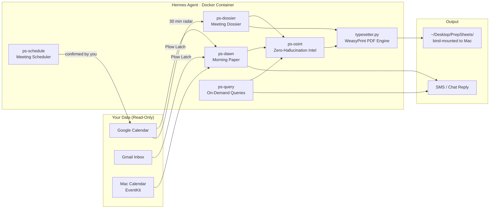
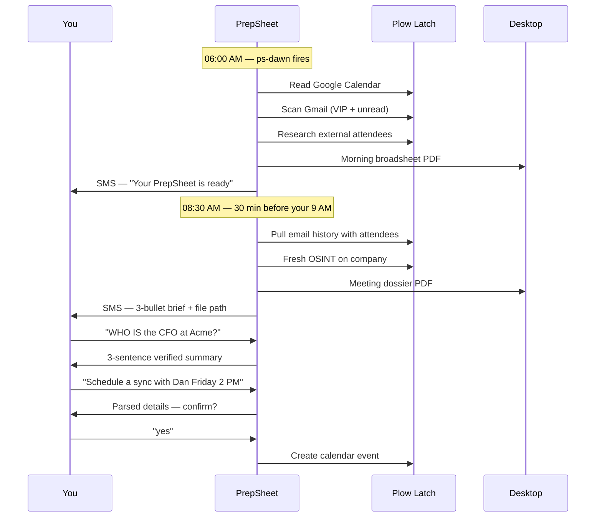
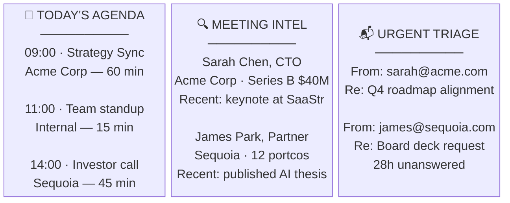

<h1 align="center">The PrepSheet</h1>

<p align="center">
  <b>An autonomous intelligence daemon that reads your calendar, researches every person you're meeting,<br>
  and has a vintage newspaper waiting on your desktop before you wake up.</b>
</p>

<p align="center">
  <a href="#how-it-works">How it works</a> ·
  <a href="#install-5-minutes">Install</a> ·
  <a href="#what-it-will-not-do">Boundaries</a> ·
  Built for the <a href="https://luma.com/3uftu95w">Hermes Hackathon</a>
</p>

---

You have a 9 AM with someone you've never met. Their company just raised a Series B. They sent you an email last Tuesday that you didn't reply to. You know none of this at 8:55.

The PrepSheet does. It was working while you slept.

Every morning before 6 AM it reads your calendar, scans your unread emails, and researches every external attendee — LinkedIn, Crunchbase, recent news — with zero hallucination. It calculates the single most important thing you need to know today, then lays it all into a vintage three-column broadsheet PDF sitting on your desktop when you open your laptop.

Thirty minutes before every external meeting, a one-page dossier arrives: who you're meeting, what you last talked about, what to say. Text it a name and it tells you who they are. Text it `NEXT` and it tells you what's coming. No app to open. No tab to switch to.

---

## What makes it different

Every prep tool is stateless: it sees one request, answers it, forgets it.
The PrepSheet keeps **context across your entire day** — calendar, email history, OSINT cache — and reasons across all of it:

- *"Prep me for my 3 PM with Stripe"* → pulls their recent funding news, your last email thread with them, and writes talking points
- *"Who is Sarah from Acme?"* → 3-sentence verified summary from public sources, cached for 30 days
- *"Schedule a sync with Dan tomorrow at 2 PM"* → parsed, confirmed with you, written to calendar — not before

Nothing is guessed. If a person has no public profile, it says exactly that.

---

## How it works

The agent **thinks** in a container. The intelligence **happens** through Plow Latch — authenticated access to your already-logged-in browser sessions, no OAuth, no API keys.



---

## What a day looks like



---

## The seven skills

| Skill | What it does |
|---|---|
| `ps-setup` | Conversational onboarding — internal domains, VIP senders, schedule preferences |
| `ps-dawn` | Morning broadsheet — fires at 6 AM, generates the daily PDF |
| `ps-dossier` | Meeting dossier — triggered 30 min before every external meeting |
| `ps-query` | On-demand queries — WHO IS, NEXT, DIGEST, URGENT |
| `ps-schedule` | Meeting scheduling — parses natural language, confirms, creates event |
| `ps-osint` | Intelligence engine — LinkedIn, Crunchbase, news via Plow Latch, 30-day cache |
| `ps-shared` | Toolbox — WeasyPrint typesetter, Mac EventKit calendar, OSINT cache, SMS |

---

## The broadsheet format

Every morning paper is a fixed three-column vintage newspaper layout:



---

## Install (5 minutes)

### Requirements

- **Docker** (Desktop or Engine)
- **Git**
- **Plow Latch** — install from [Latch](https://plow.co/latch)

---

### Step 1 — Install the Plow CLI

```sh
git clone https://github.com/plow-pbc/plow-agents.git
export PATH="$PWD/plow-agents/bin:$PATH"
plow-agents login          # authenticates by texting you a code
```

---

### Step 2 — Get a phone line

```sh
plow-agents lines            # shows your available lines (ln_...)
plow-agents mint ln_xxxxx    # creates ./plow-credentials
```

Save that line ID — you'll text it to interact with The PrepSheet.

---

### Step 3 — Clone and build

```sh
git clone https://github.com/anuj123upadhyay/PrepSheet.git
cd PrepSheet
mv ../plow-credentials .     # move credentials into project
docker compose up --build -d
```

First build takes 3–5 minutes (pulls base image + installs WeasyPrint). Watch for startup:

```sh
docker compose logs -f agent                              # follow logs
docker compose down -v && docker compose up --build -d   # full reset if needed
```

---
### Step 4: Register on Agent Index (required)

Register your installation to track on the [AI Worth Using Agent Index](https://aiworthusing.com/agent-index):

```sh
# Download client
curl -O https://raw.githubusercontent.com/plow-pbc/agent-index-client/main/standalone/agent_index_client.py

# Register (use your own AGENT_ID, like "PrepSheet")
set -a; . ./plow-credentials; set +a
python3 agent_index_client.py \
  --register \
  --agent "prepsheet-$(whoami)" \
  --name "PrepSheet - $(whoami)" \
  --blurb "Autonomous intelligence daemon that reads your calendar, researches every person you're meeting"
```

Your installation now reports hourly to its Agent Index page.

---

### Step 5 — Talk to it

Text your Plow line to start. The PrepSheet will guide you through first-time setup conversationally — internal domains, VIP senders, morning paper time.

Once configured, PDFs appear at `~/Desktop/PrepSheets/` automatically. The container writes directly to your Mac desktop via a Docker volume mount — no file transfer, no copy step.

---

## What it will not do

- Publish, archive, or mark a single email as read
- Accept, decline, or modify any existing calendar invite
- Send an email on your behalf without confirmation
- Create a calendar event without your explicit confirmation
- Fabricate attendee bios — if there's no public record, it says so
- Write any temp file outside its sandbox (`/var/lib/hermes/`) — never `/tmp/`

---

## Under the hood

| Path | What |
|---|---|
| `runtime/SOUL.md` | Persona, hard rules, and the seven skills |
| `ps-shared/scripts/typesetter.py` | HTML → PDF engine via WeasyPrint — three-column broadsheet and dossier layouts |
| `ps-shared/scripts/mac_calendar_simple.py` | Direct macOS EventKit integration for local calendar read/write |
| `ps-shared/scripts/osint_cache.py` | 30-day OSINT profile cache at `~/.hermes/prepsheet/osint_cache.json` |
| `ps-shared/scripts/meeting_monitor.py` | Background meeting radar — fires ps-dossier 30 min before external meetings |
| `ps-shared/scripts/sms.py` | Outbound SMS with rate-limiting and audit log |
| `Dockerfile` | Debian 13 (trixie) base, WeasyPrint + system PDF deps pre-installed |
| `compose.yml` | `~/Desktop/PrepSheets` bind-mounted; `agent-home` volume for session persistence |

---

## Licence

[LICENSE](LICENSE).

---

## The Plow tools it uses

- **[Plow Latch](https://plow.co/latch)** — Authenticated, sandboxed access to your already-logged-in browser. This is how The PrepSheet reads Google Calendar, Gmail, LinkedIn, Crunchbase, and the web without a single API key or OAuth flow. Every web action is approved through Latch.
- **[Hermes](https://github.com/nousresearch/hermes-agent)** — The agent conversation framework. Powers the skill routing, conversational SMS loop, cron scheduling, and the runtime that keeps The PrepSheet running autonomously 24/7.
- **[agent-index-client](https://github.com/plow-pbc/agent-index-client)** — Usage reporting to the Plow Agent Index.

---

*Prepared before dawn. Delivered before coffee.*
